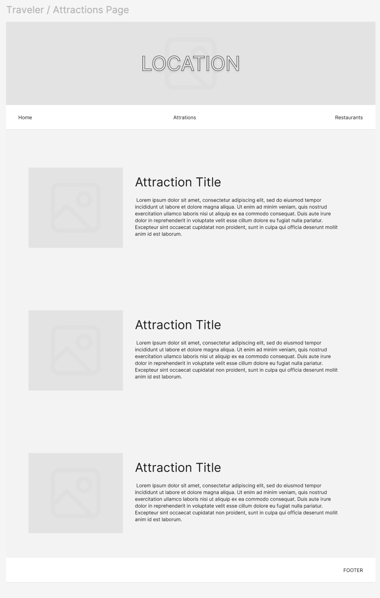

# CSC317-F24-P1: Travel Guide

In this project, you will make a website about a place. You're welcome to choose any any city or country -- it can be somewhere you want to travel to but have never been, somewhere you enjoyed visiting, or your hometown. If you don't have a particular location you'd like to make a website for, San Francisco is also a perfectly good option!

Goals for this assignment:
* create a static website
* get practice with creating HTML documents
* get practice with styling pages with CSS

## Section 1: Hello World

### Set Up index.html
To start off, let's make our first page. Make a file called `index.html`. This will be the default page for your website.

Remember that HTML has:
* a doctype declaration
* html tags that contain `head` and `body` elements
    * metadata goes in the `head`
    * the content of the page goes into the `body`

Now, set the title and icon with `title` and  `link` elements in `head`. You're welcome to use the `icon.svg` provided or choose your own.

Also, add a `p` element in the body with the content "hello world".

### Viewing Your Work
To view your work in the browser, you can just open the html file in a browser, and it should render as you expect.

If you're using VSCode, I'd suggest running with LiveServer, which will actually bring up a server on a port on your computer, and open up a browser pointing at it. It has the nice perk that it also reloads the file as you save changes in real time.

You can install it by going to `Settings > Extensions` and searching "Live Server".

To launch the server, click the "Go Live" button in the lower right hand corner.

This should open up a window with "hello world".

Either way, you should be able to see your page:

Great job! You're ready to start working on the project!

Remember -- to commit, the three steps are
* git add `filename`
* git commit -m "commit message"
* git push origin main

## Section 2: Website Features

Now that you have the basic workflow set up, let's take a look at the features of the site we're going to build.

Note that for all of the sections below, using placeholder text is fine for this assignment as long as it is a reasonable subsitute in terms of length. you might consider looking up a "lorem ipsum" generator. Of course, you're welcome to fill it in with actual text as well!

### Home Page

All pages should use semantic HTML elements -- include a header, a footer, and a nav bar. (Hint: You might consider using FlexBox for the nav bar spacing.) 

The homepage should additionally display an image and a paragraph of text introducing the location below it. 

Please have your page adhere to the wireframe layout:

A sample implementation:

### Attractions Page

The attractions page should show 3 or more attraction listings. Each listing should include an image on the left and a name and description on the right. You can consider achieving this layout with either the `display` property as discussed in class, or with Flexbox. 

Please have your page adhere to the wireframe layout:

A sample implementation:

### Restaurants Page

The restaurants page should include 6 or more entries of local restaurants or food stands featuring a place to eat. Each entry should have an image, the name of the business and an address.
You might consider using Flexbox or Grid to format the entries on the page. There should be 3 per line.

Please have your page adhere to the wireframe layout:

A sample implementation:

___

Please fill out the following when you submit.

Time spent on this assignment: 5hrs

